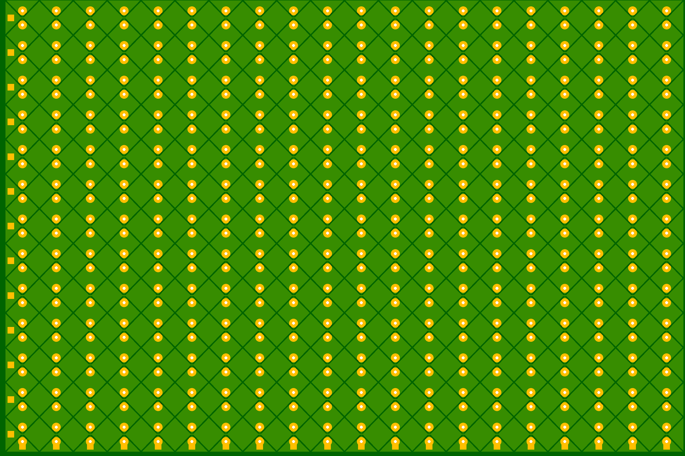
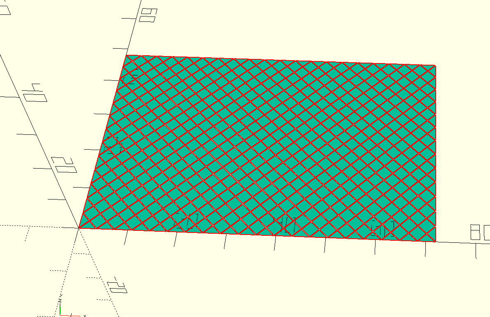
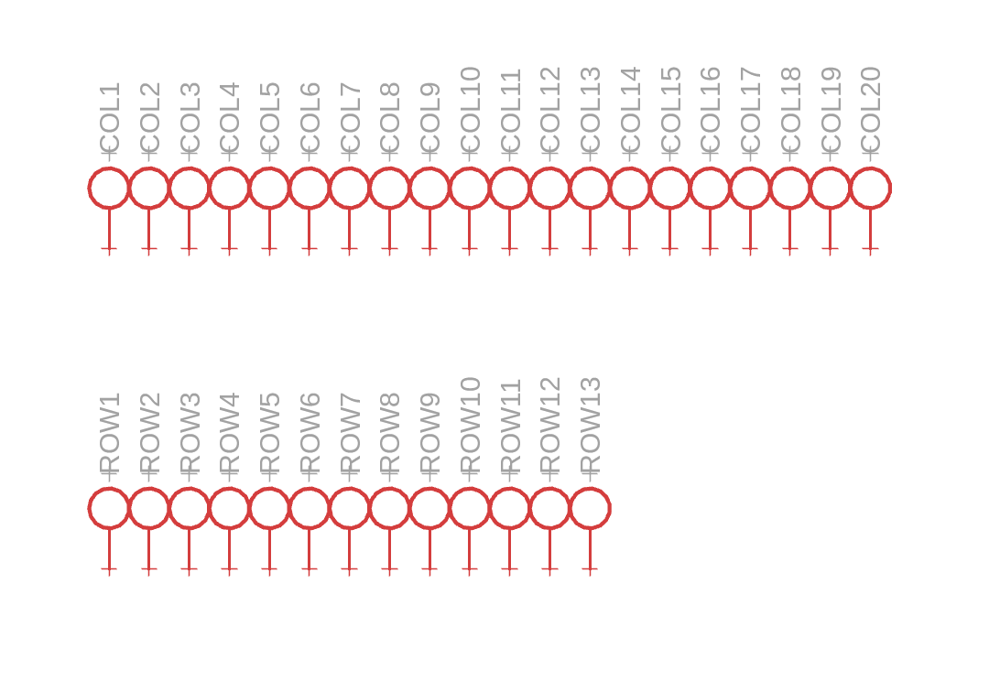

Touchpad Generator
==================

A tool consisting of two scripts to create touchpads as seen on Notebooks.
It generates a Eagle compatible board file that can be cleanly imported into pretty much any EDA tool.
The main pattern is turned into polygon pours that get the correct net name assigned for the various columns and rows and routes each of them so that the only thing left to do is to connect them to your touch controller IC.

These can be very labor intensive to create especially when they use a lot of electrodes.
A modern touchpad can easily consist of thousands of circuit elements that you would have to manually draw and route.

This script was used to build the touchpad for the MNT Reform Next based on an Azoteq IQS9150 touchpad controller.

It has only been tested with rectangular shapes but the OpenSCAD script that generates the main pattern works with any shape even custom dxf outlines. The python script that converts that into usable PCB features might fail to make something sensible out of odd shapes though as it might have unintended hard baked assumptions, it should be fairly easy to adapt though.

The OpenSCAD script comes courtesy of Texas Instruments. I modified it a bit to work better with generating a PCB out of the exported dxf.

Why not generate KiCad files? Mostly because the KiCad file format is really complex and any industry EDA tool including KiCad support the Eagle XML file format so it is usable for more people.
The Eagle XML file format is also equally openly documented and very easy to read and write. So it is not a proprietary file format even if Eagle itself is not open.

Installation
-----------
You need OpenSCAD Stable (2021) installed. The nightly version has a broken DXF output (last tested in February 2025) and a recent version of Python 3.

`pip install requirements.txt`

Usage
------

Open the `touchpad.scad` project in OpenSCAD. The script contains detailed usage instructions, for a simple rectangular pattern all you need to change is the `rows`, `columns`, `touchpad_width`, `touchpad_height` and `diamond_spacing` (this is essentially your trace spacing).
Then render the design (the pattern should go from yellow to teal like below) and then go to `File->Export->Export as DXF` to create the dxf file of your diamond pattern, name it `touchpad.dxf`.

Next open the Python script and edit the variables at the top that you care about. This script has no CLI interface. You will mostly care about the via and trace width parameter.

The script will look for a `touchpad.dxf` in the same folder.

`python create_touchpad_pcb.py`

It will generate and insert the routed pattern into the empty.brd/sch design file. You can provide your own if needed, it makes no assumption of what exists in the file.

It will print a bit of diagnostic info like how many rows and columns it detected.

The generated Touchpad.brd/sch contain your finished touchpad. The schematic file is optional, it contains testpoints that you can assign to your touch IC. The testpoints are little rectangles on the left side of each row and the bottom of each column that you can use as your routing target from your IC. The Testpoint schematic symbols have a zero length net on them that corresponds to the netname of its column/row in the board file.

